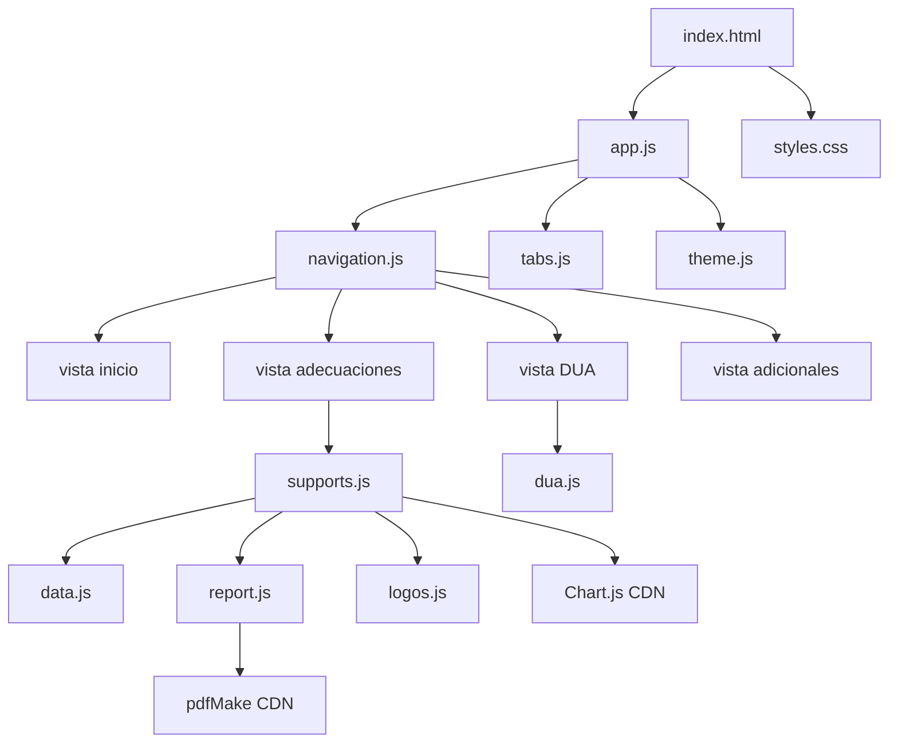
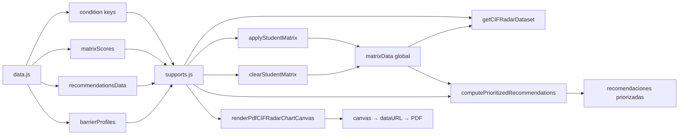
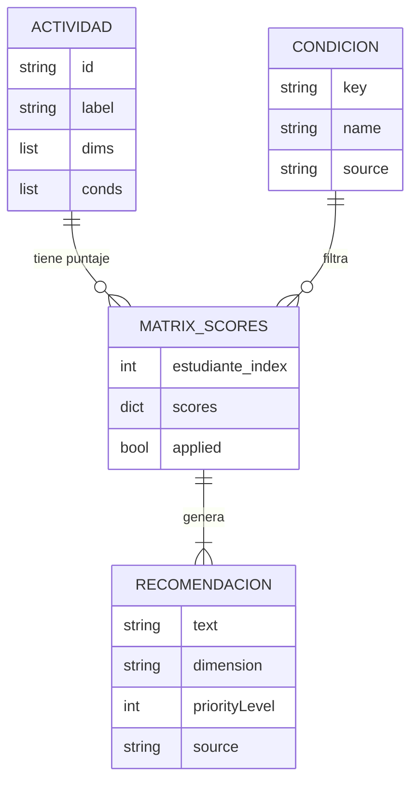
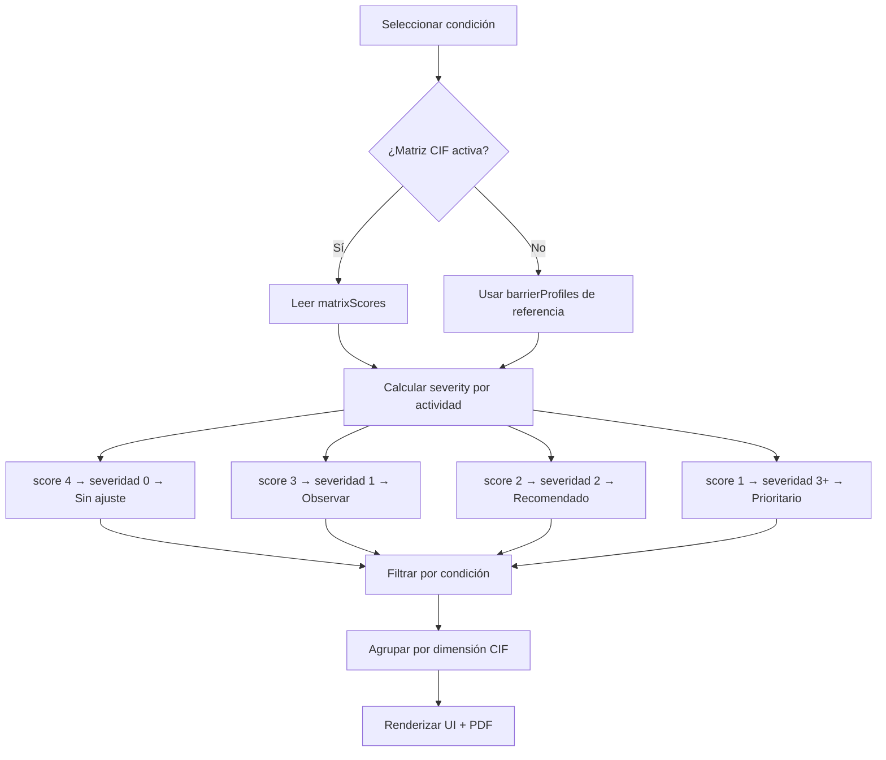

# Arquitectura del Planificador Inclusivo UIE

## Diagrama de módulos



## Flujo de datos



## Modelo CIF/OMS



## Flujo de recomendaciones



## Ciclo de renderizado del radar

```mermaid
flowchart LR
    A[getStudentMatrixScores] --> B{¿Tiene datos?}
    B -->|Sí| C[4 - score → necesidad apoyo]
    B -->|No| D[retorna [0,0,0,0,0]]
    
    C --> E[Chart.js radar]
    D --> E
    
    E --> F[Legend interactivo]
    E --> G[Tooltip con severidad]
    
    subgraph PDF
        H[renderPdfCIFRadarChartCanvas]
        I[canvas 340x350 a 2x DPI]
        H --> I
    end
    
    C --> H
    F --> J[Toggle visibilidad]
    G --> J
```

## Matriz de datos

### Actividades CIF (11)

| ID | Label | Dimensiones |
|---|---|---|
| `escribir` | Escribir | evaluacion, tech |
| `leer` | Leer | materials |
| `hablar` | Hablar | interaction |
| `recordar` | Recordar cosas | methods |
| `examenes` | Rendir exámenes | evaluacion |
| `practicos` | Participar en ramos prácticos | methods, interaction |
| `sala_clases` | Participar en la sala de clases | interaction, context |
| `sociales` | Participar en actividades sociales | interaction |
| `practicas_rec` | Participar en actividades prácticas | interaction, context |
| `ayuda` | Obtener ayuda | interaction |
| `acceder` | Acceder a la institución | context |

### Niveles de severidad (semáforo)

| Score CIF | Severidad | Etiqueta | Color |
|---|---|---|---|
| 4 | 0 | Sin ajuste | Gris |
| 3 | 1 | Menor / Observar | Verde |
| 2 | 2 | Moderado / Recomendado | Amarillo |
| 1 | 3+ | Prioritario / Intervenir | Rojo |

## PDF (pdfMake)

El proyecto tiene dos puntos de generación de PDF:

1. **Plan de apoyo** (`supports.js` → `generatePlanPDF`):
   - Desde el modal "Plan" en la vista de adecuaciones
   - Incluye DUA + Buenas Prácticas + Radar (canvas 2x) + Recomendaciones
   - Cada sección en página separada

2. **Reporte completo** (`report.js` → `generatePdfMake`):
   - Desde la vista Reportes
   - Incluye DUA + Buenas Prácticas + Barras CIF + Recomendaciones

### Proceso del radar en PDF

```mermaid
flowchart LR
    A[renderPdfCIFRadarChartCanvas] --> B[Mide nombres estudiantes]
    A --> C[Mide etiquetas actividades]
    C --> D[Calcula ancho canvas dinámico]
    B --> D
    D --> E[Dibuja radar en canvas]
    D --> F[Dibuja leyenda estudiantes abajo]
    D --> G[Dibuja niveles severidad]
    E --> H[toDataURL PNG]
    G --> H
    H --> I[pdfMake image width: min(W, 360)]
```

## Tema oscuro/claro

- Detectado por clase `theme-dark` en `<body>`
- `theme.js` maneja toggle manual + persistencia en localStorage
- `getRadarThemeColors()` retorna colores según modo
- `initRadarThemeObserver()` en `app.js` re-renderiza radar al cambiar tema
